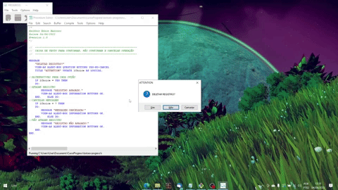
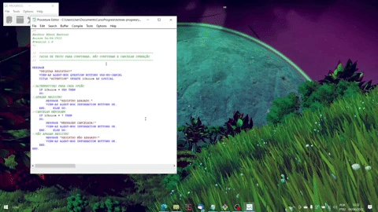

# Message Box para confirmar exclusão de registro
Este trecho de código simula uma confirmação de exclusão de registro no banco de dados.
Utilizei a lang Pogress.

## Conteúdo
### Registro apagado
  
### Registro não apagado
 
### Operação cancelada
 
 
